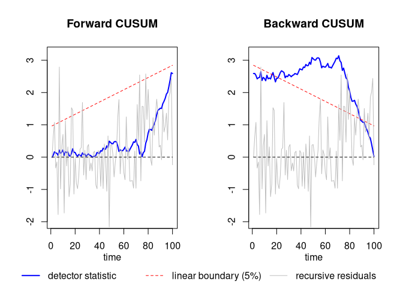

<!-- README.md is generated from README.Rmd. Please edit that file -->

# backCUSUM

<!-- badges: start -->

<!-- badges: end -->

The goal of backCUSUM is to provide functionality to apply the methods
developed in the paper “[Backward CUSUM for Testing and Monitoring
Structural Change](https://arxiv.org/abs/2003.02682)” by [Sven
Otto](https://www.svenotto.com) and [Jörg
Breitung](https://wisostat.uni-koeln.de/en/institute/professors/breitung).
The repository also provides code to replicate all simulation results in
this paper.

## Installation

You can install the package using the following command:

``` r
if (!require("remotes")){install.packages("remotes")}
remotes::install_github("ottosven/backCUSUM")
```

### Troubleshooting

Error messages during installation may be due to the fact that the necessary compilers required to build packages are not installed:

* Windows: Please make sure that Rtools are installed: https://cran.r-project.org/bin/windows/Rtools/.

* Linux (Ubuntu-based):

``` r
apt-get install libcurl4-openssl-dev libxml2-dev libssl-dev g++ gfortran libblas-dev liblapack-dev liblapack3 libopenblas-base
```

* Linux (Arch-based):

``` r
sudo pacman -S gcc-fortran
```

## Example

This is a basic example to reproduce Figure 2 of the paper:

``` r
library(backCUSUM)
RNGkind("L'Ecuyer-CMRG")
set.seed(42)
T <- 100
breakpoint <- floor(3*T/4)
beta1 = 0
beta2 = 1
u <- rnorm(T,0,1)
y <- c(rep(beta1,breakpoint), rep(beta2,T-breakpoint)) + u
Qt <- Q.detector(y~1)
BQt <- BQ.detector(y~1)
wt <- get.recresid(y~1)
```

This is the plot:


